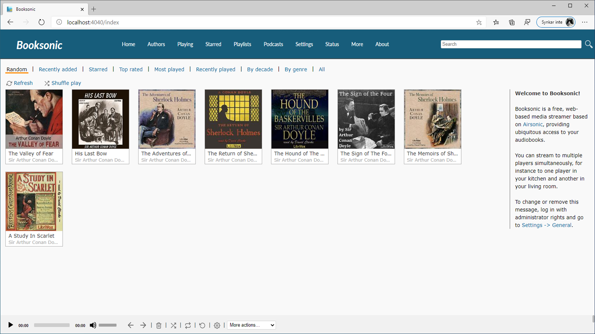

Booksonic Air
========

What is Booksonic?
-----------------

Booksonic is a platform for accessing the audibooks you own wherever you are.
At the moment the platform consists of

 - **[Booksonic Air](https://github.com/popeen/Booksonic-Air)** - A server for streaming your audiobooks, successor to the original Booksonic server. Based on Airsonic.
 - **[Booksonic App](https://github.com/popeen/Booksonic-App)** - An android app for connection to Booksonic servers. Based on DSub
 
**Upcoming:**
 - **Booksonic Bridge** - This is an upcoming serverside software that will allow you to use third party servers like Plex, Emby, Youtube etc. It is currently in closed beta and no timeframe is given.

**Extra tools**
 - **[Booksonic ODM2Meta](https://github.com/popeen/Booksonic-Export-Booksonic-Metadata-from-ODM-Files)** - A script for quickly converting your ODM files to metadata that can be used by Booksonic. In the future this will not be needed as Booksonic will soon support ODM files natively.
 - **[Bulk convert UTF8](https://github.com/popeen/Booksonic-Bulk-convert-to-UTF8)** - A script for bulk conversion of meta files to UTF-8
 - **[Booksonic Library Editor](https://github.com/galacticat/booksonic-library-editor)** - A third party Library editor

While there is no iOS app available (yet) Booksonic fully supports the Subsonic API so you will be able to use it with any app that supports that, you will miss out on some Booksonic specific features but  you will be able to listen without problem.

More information about the project can be found at [booksonic.org](https://booksonic.org)

What is Booksonic Air?
-----------------
First of all, credit where credit is due, Booksonic Air is not built from scratch, instead it is building on top of the amazing work done by the people over at [Airsonic](http://www.airsonic.org/) .

Now then, Booksonic Air is a server for hosting the audiobooks you own and reach them from wherever you are. Perfect for those boring bus rides!

It is designed to handle very large collections (hundreds of gigabytes). Although optimized for MP3 streaming, it works for any audio or video format that can stream over HTTP, for instance AAC and OGG. By using transcoder plug-ins, Booksonic supports on-the-fly conversion and streaming of virtually any audio format, including WMA, FLAC, APE, Musepack, WavPack and Shorten.

If you have constrained bandwidth, you may set an upper limit for the bitrate of the streams. Booksonic will then automatically resample to a suitable bitrate.

Based on Java technology, Booksonic runs on most platforms, including Windows, Mac, Linux and Unix variants.

History
-----

The original [Subsonic](http://www.subsonic.org/) is developed by Sindre Mehus Subsonic and was open-source through version 6.0-beta1, and closed-source from then onwards.

At the end of 2015 Popeen forked Subsonic and built the first Booksonic server for his own personal use, this was about half a year before Subsonic went closed-source.

With the announcement of Subsonic's closed-source future the fork Libresonic grew out of what was previously a Subsonic build without license checks created by Eugene E. Kashpureff Jr.

Around July 2017, it was discovered that the maintainer of Libresonic had different intentions/goals
for the project than some contributors had.  Although the developers were
hesitant to create a fork as it would fracture/confuse the community even
further, it was deemed necessary in order to preserve a community-focused fork.
This new fork is what we know today as [Airsonic](http://www.airsonic.org/)
To reiterate this more clearly:

Airsonic's goal is to provide a full-featured, stable, self-hosted media server
based on the Subsonic codebase that is free, open source, and community driven.

Moving on to summer of 2020 and Booksonic has grown to now having a couple of thousand users but the server is still built on top of the old Subsonic codebase as well as full of bugs and is over all not very polished, on top of that community members that want to do their own modifications find it hard to build the server from source. Popeen now decides to fork Airsonic and port the Booksonic functionality over, thus Booksonic Air was born.

License
-------

Booksonic Air is free software and licensed under the [GNU General Public License version 3](http://www.gnu.org/copyleft/gpl.html). The code in this repository (and associated binaries) are free of any "license key" or other restrictions. If you wish to thank the maintainer of this repository, please consider a donation to the Electronic Frontier Foundation.

The cover zooming feature is provided by [jquery.fancyzoom](https://github.com/keegnotrub/jquery.fancyzoom),
released under [MIT License](http://www.opensource.org/licenses/mit-license.php).

The icons are from the amazing [feather](https://feathericons.com/) project,
and are licensed under [MIT license](https://github.com/feathericons/feather/blob/master/LICENSE).

Usage
-----

All Booksonic downloads can be found at
https://booksonic.org/download

Pull requests
---------
All pull requests are welcome to any of the Booksonic projects

Community
---------
If you have any questions or ideas, come visit us at [/r/booksonic](https://reddit.com/r/booksonic) over on Reddit

